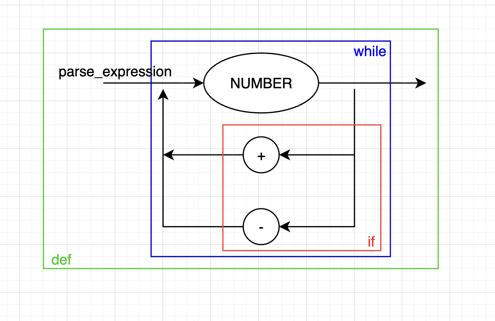

# logica-da-computacao-7-sem

[](https://compiler-tester.insper-comp.com.br/svg/cauepda/logica-da-computacao-7-sem)

This repository is monitored by Compiler Tester for automatic compilation status.

# Diagrama Sintático



```ebnf

PROGRAM = { STATEMENT } ;
STATEMENT = (ASSIGNMENT | VARDEC | PRINT | IF | WHILE | BLOCK | ε), EOL ;
ASSIGNMENT = IDENTIFIER, "=", BOOLEXPRESSION ;
VARDEC = "local", IDENTIFIER, TYPE, [ "=", BOOLEXPRESSION ] ;
PRINT = "print", "(", BOOLEXPRESSION, ")" ;
IF = "if", "(", BOOLEXPRESSION, ")", "then", BLOCK, [ "else", BLOCK ], "end" ;
WHILE = "while", "(", BOOLEXPRESSION, ")", "do", BLOCK, "end" ;
BLOCK = "do", { STATEMENT }, "end" ;
BOOLEXPRESSION = BOOLTERM, { "or", BOOLTERM } ;
BOOLTERM = RELEXPRESSION, { "and", RELEXPRESSION } ;
RELEXPRESSION = EXPRESSION, [ ("==" | "<" | ">"), EXPRESSION ] ;
EXPRESSION = TERM, { ("+" | "-" | ".."), TERM } ;
TERM = FACTOR, { ("*" | "/"), FACTOR } ;
FACTOR = ("+" | "-" | "not"), FACTOR
       | "(", BOOLEXPRESSION, ")"
       | NUMBER
       | STRING
       | BOOL
       | IDENTIFIER
       | "read", "(", ")" ;
TYPE = "number" | "string" | "boolean" ;
BOOL = "true" | "false" ;
STRING = '"', { CHAR }, '"' ;
NUMBER = DIGIT, { DIGIT } ;
DIGIT = 0 | 1 | ... | 9 ;
IDENTIFIER = LETTER, { LETTER | DIGIT | "_" } ;
LETTER = a | b | ... | z | A | B | ... | Z ;
CHAR = qualquer caractere exceto '"' ;

```